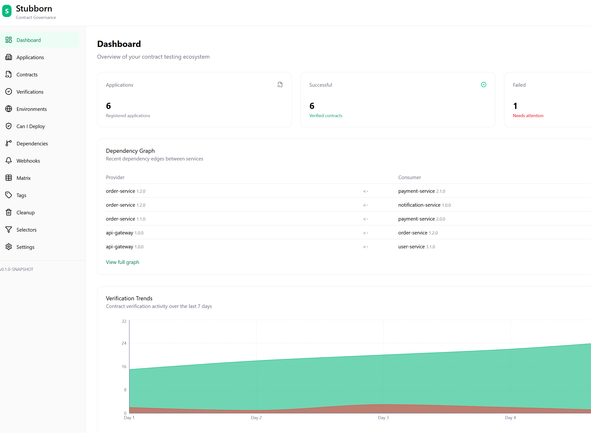
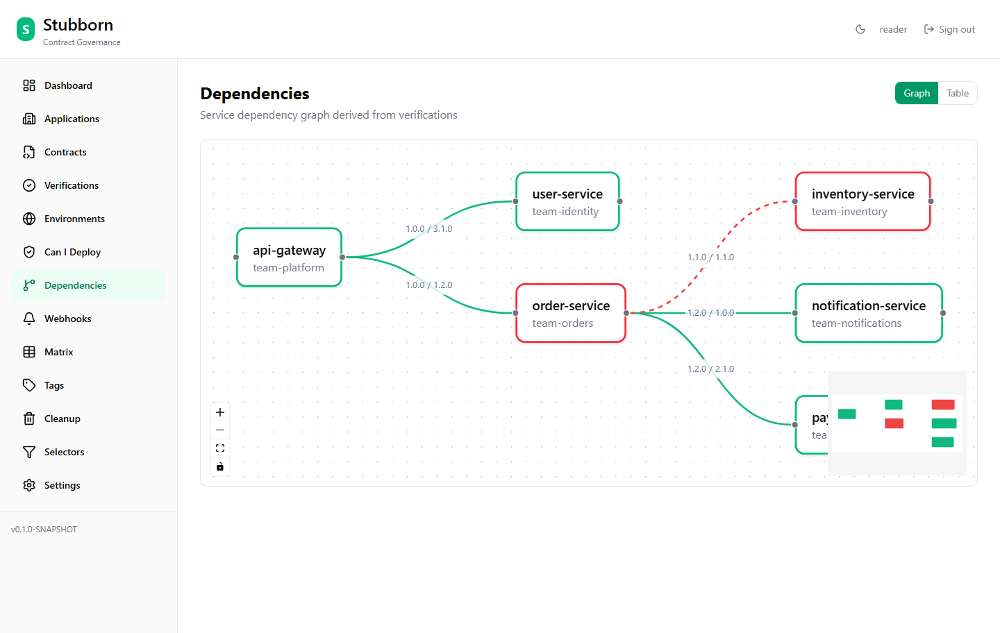
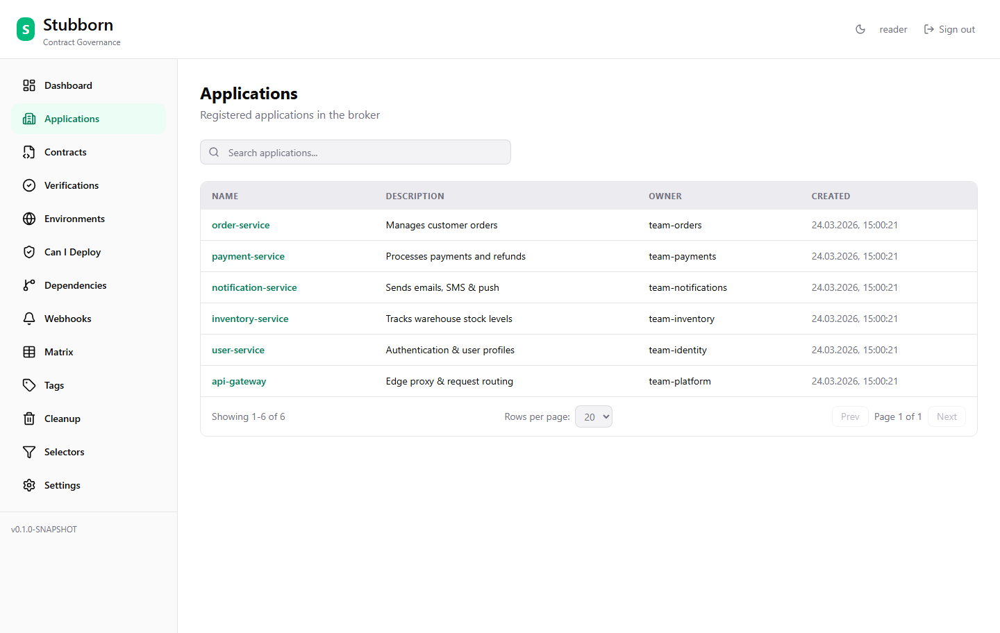
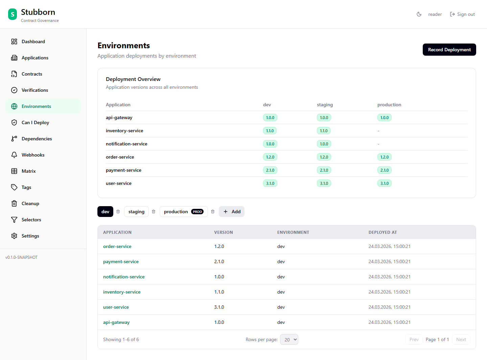
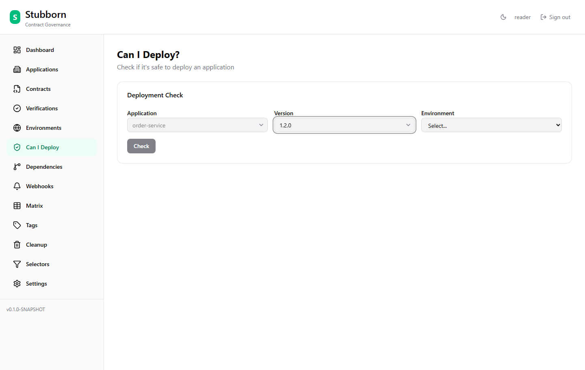
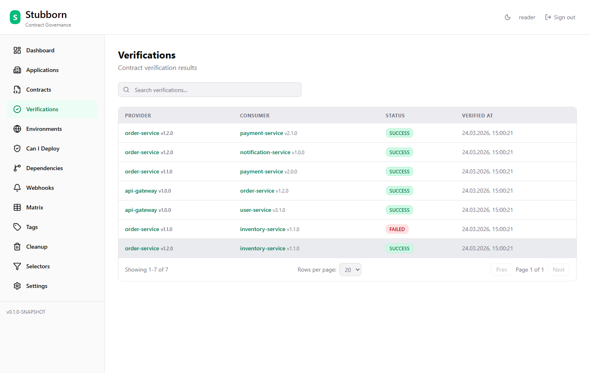
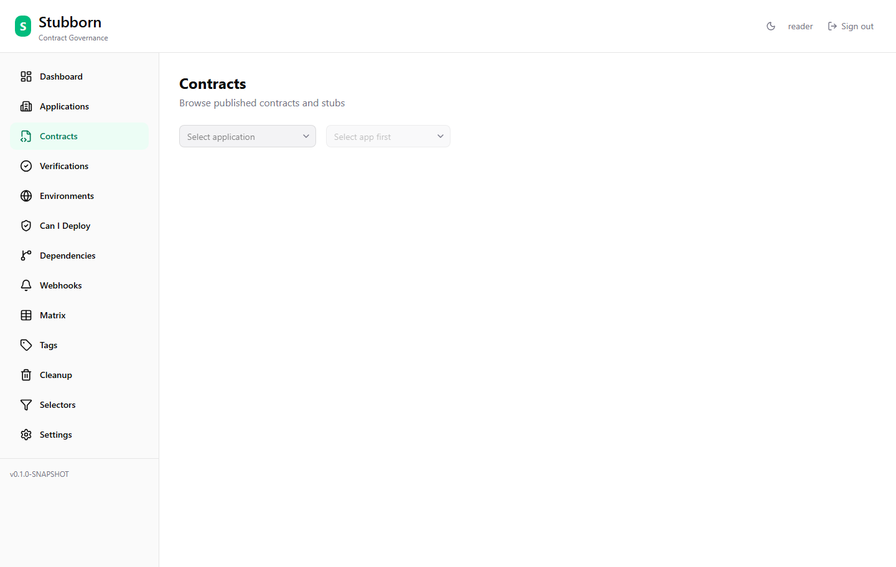
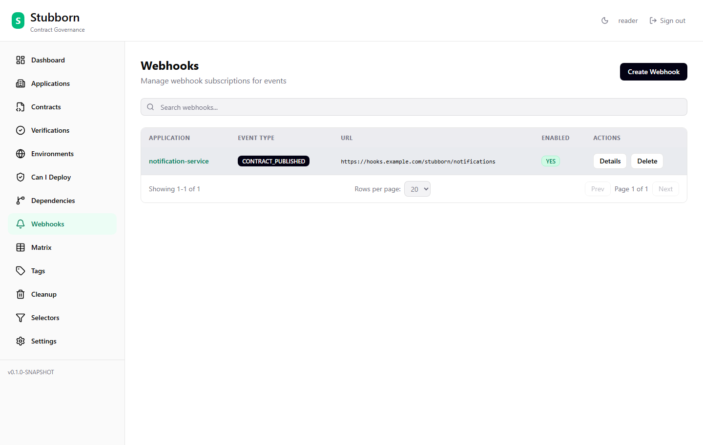
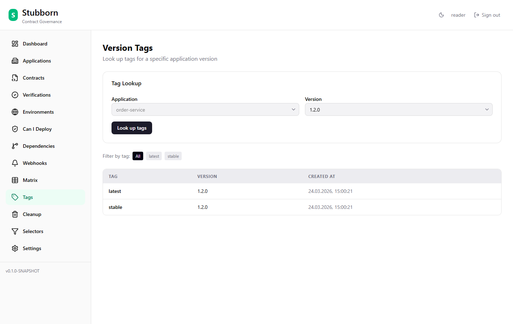

# Stubborn

Branch-aware contract governance for Stubborn Contract — the community continuation of Spring Cloud Contract.

**Your contracts should be stubborn — they don't break just because someone pushed on a Friday.**

Heavily inspired by [Pact Broker](https://github.com/pact-foundation/pact_broker) — the gold standard for contract broker tooling. Stubborn brings the same governance model natively to the Stubborn Contract ecosystem, and remains compatible with existing Spring Cloud Contract stubs. The broker builds on the `sh.stubborn:stubborn-contract-*` libraries (pinned via the `stubborn-contract-dependencies` BOM).

## Screenshots

| Dashboard | Dependency Graph |
|-----------|-----------------|
|  |  |

| Applications | Environments |
|-------------|-------------|
|  |  |

| Can I Deploy | Verifications |
|-------------|--------------|
|  |  |

| Contracts | Webhooks |
|----------|---------|
|  |  |

| Tags |
|------|
|  |

Try the live demo at [demo.stubborn.sh](https://demo.stubborn.sh).

## License

Apache License 2.0

## Group ID

`sh.stubborn`

## Modules

- `broker/` — Core broker app (REST API, DB, UI static resources, stubs JAR)
- `ui/` — React 19 frontend (Vite + TailwindCSS + React Query)
- `broker-api-client/` — Generated REST client JAR (OpenAPI Generator)
- `broker-stub-downloader/` — StubDownloaderBuilder SPI (stubborn:// protocol; legacy sccbroker:// alias still supported)
- `broker-contract-publisher/` — Core Java library (file scanning, REST calls)
- `broker-maven-plugin/` — Maven Mojo wrapping broker-contract-publisher
- `broker-gradle-plugin/` — Gradle plugin wrapping broker-contract-publisher
- `stub-runner/` — Stub Runner Boot (serves broker stubs for consumer testing)
- `js/` — TypeScript/Node.js SDK (npm packages for cross-language contract testing)
- `build-parent/` — Shared parent POM (dependency mgmt, plugin config)
- `samples/` — Sample apps demonstrating contract testing
- `e2e-tests/` — Playwright browser-based E2E tests
- `docs/` — VitePress documentation (published to docs.stubborn.sh)
- `charts/` — Helm chart + Kustomize overlays

