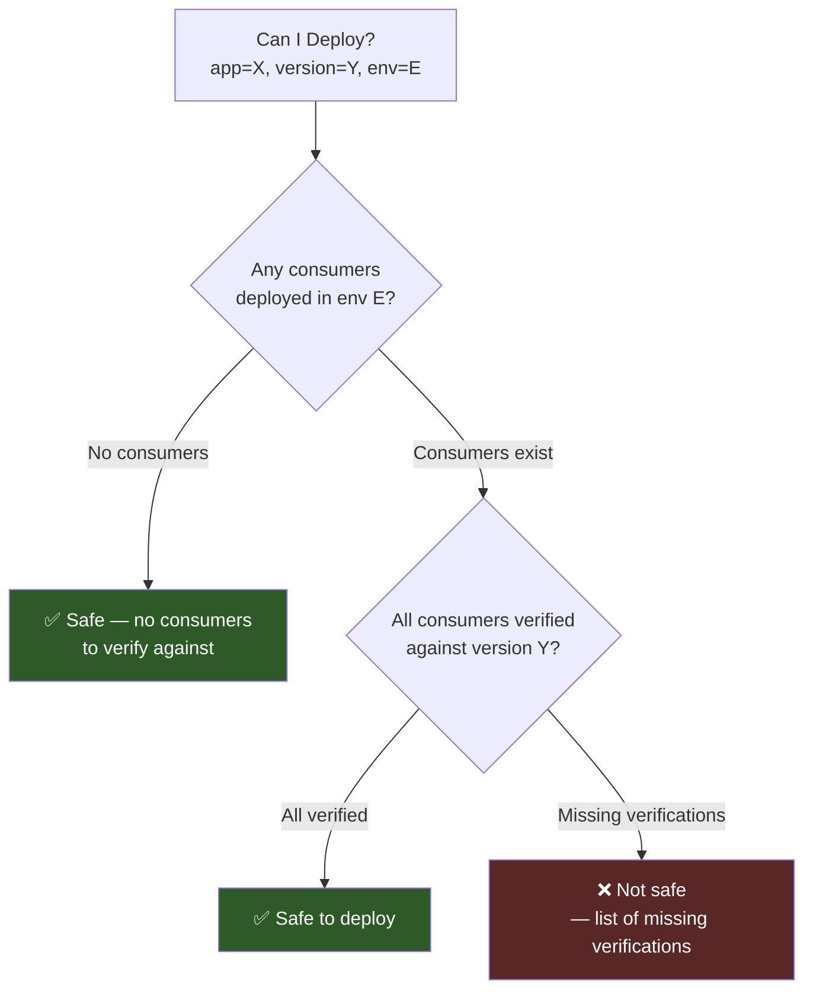

# Can I Deploy

Safety gate: determine if it is safe to deploy a specific version to an environment.

## Overview

The Can I Deploy check answers: "If I deploy version X of application A to environment E,
will all consumers in that environment have verified compatibility with version X?"

It examines:

1. All applications deployed in the target environment
2. For each consumer deployed there, whether a successful verification exists against the
   provider version being deployed

## API

* `GET /api/v1/can-i-deploy?application=X&version=Y&environment=Z&branch=B` — Safety check
  (`branch` is optional)

Returns `{"application": "...", "version": "...", "environment": "...", "branch": "...", "safe": true/false, "summary": "...", "consumerResults": [...]}`.

See specification: [docs/specs/005-can-i-deploy.md](https://github.com/stubborn-sh/stubborn/blob/main/docs/specs/005-can-i-deploy.md)

