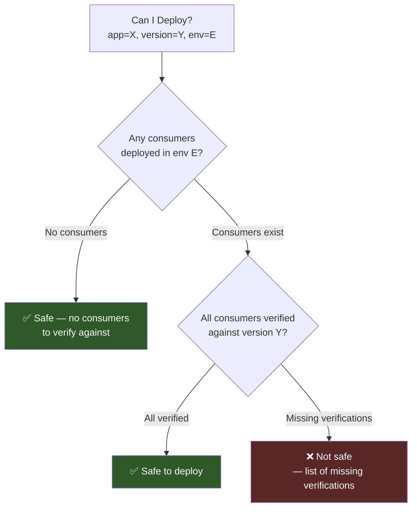

# Can I Deploy

Safety gate: determine if it is safe to deploy a specific version to an environment.

## Overview

The Can I Deploy check answers: "If I deploy version X of application A to environment E,
will all consumers in that environment have verified compatibility with version X?"

It examines:

1. All applications deployed in the target environment
2. For each consumer deployed there, whether a successful verification exists against the
   provider version being deployed



## API

### Request

```bash
curl -s \
  "https://stubborn.example.com/api/v1/can-i-deploy?application=my-service&version=1.2.3&environment=production" \
  -H "Authorization: Basic <base64-encoded-credentials>"
```

The optional `branch` query parameter scopes the check to a specific branch of the provider.

### Success response (safe to deploy)

```
HTTP/1.1 200 OK
Content-Type: application/json
```

```json
{
  "application": "my-service",
  "version": "1.2.3",
  "environment": "production",
  "safe": true,
  "summary": "All 2 consumer(s) verified successfully",
  "consumerResults": [
    {
      "consumerName": "payment-service",
      "providerName": "my-service",
      "success": true,
      "contractUrl": "https://stubborn.example.com/api/v1/contracts/payment-service/my-service/1.2.3"
    },
    {
      "consumerName": "shipping-service",
      "providerName": "my-service",
      "success": true,
      "contractUrl": "https://stubborn.example.com/api/v1/contracts/shipping-service/my-service/1.2.3"
    }
  ]
}
```

### Failure response (not safe to deploy)

```
HTTP/1.1 200 OK
Content-Type: application/json
```

```json
{
  "application": "my-service",
  "version": "1.2.3",
  "environment": "production",
  "safe": false,
  "summary": "1 of 2 consumer(s) failed verification",
  "consumerResults": [
    {
      "consumerName": "payment-service",
      "providerName": "my-service",
      "success": true,
      "contractUrl": "https://stubborn.example.com/api/v1/contracts/payment-service/my-service/1.2.3"
    },
    {
      "consumerName": "shipping-service",
      "providerName": "my-service",
      "success": false,
      "contractUrl": "https://stubborn.example.com/api/v1/contracts/shipping-service/my-service/1.2.3"
    }
  ]
}
```

### HTTP status codes

| Status | Meaning |
|--------|---------|
| `200` | Check completed — inspect `safe` in the response body |
| `400` | Missing required query parameters (`application`, `version`, or `environment`) |
| `401` | Unauthorized — credentials missing or invalid |
| `404` | Unknown application — the named application has never been registered |

## What does safe=false mean?

`safe=false` means at least one consumer currently deployed to the target environment does not
have a passing contract verification against the provider version being checked.

**Rules that govern the result:**

- Every consumer deployed to the target environment must have a `SUCCESS` verification against
  the exact provider version being deployed. One failing or missing verification makes the whole
  check unsafe.
- A missing verification counts as a failure. There is no "unknown" or "skipped" state —
  absence of a verification record is treated the same as a failed one.
- **Vacuous-truth case:** if zero consumers are currently deployed to the target environment,
  the result is `safe=true`. There is nothing that could be broken, so the deployment is
  unconditionally safe.
- **Pending contracts (first-time publishers):** when a provider publishes contracts for the
  very first time and no consumer has yet verified against them, those contracts are treated as
  safe to allow the initial deployment to proceed. Once consumers begin verifying, the normal
  rules apply.

## CI/CD integration

Run the check as a deployment gate in your pipeline. A non-zero exit code means deployment
should be blocked.

**Maven plugin**

```bash
./mvnw stubborn-contract:can-i-deploy \
  -Dstubborn.application=my-service \
  -Dstubborn.version=1.2.3 \
  -Dstubborn.environment=production
```

**Gradle plugin**

```bash
./gradlew canIDeploy \
  --application=my-service \
  --version=1.2.3 \
  --environment=production
```

**npm CLI (`@stubborn-sh/cli`)**

```bash
npx @stubborn-sh/cli can-i-deploy \
  --application my-service \
  --version 1.2.3 \
  --environment production
# Exit code 0 = safe, exit code 1 = unsafe
```

See specification: [docs/specs/005-can-i-deploy.md](https://github.com/stubborn-sh/stubborn/blob/main/docs/specs/005-can-i-deploy.md)


