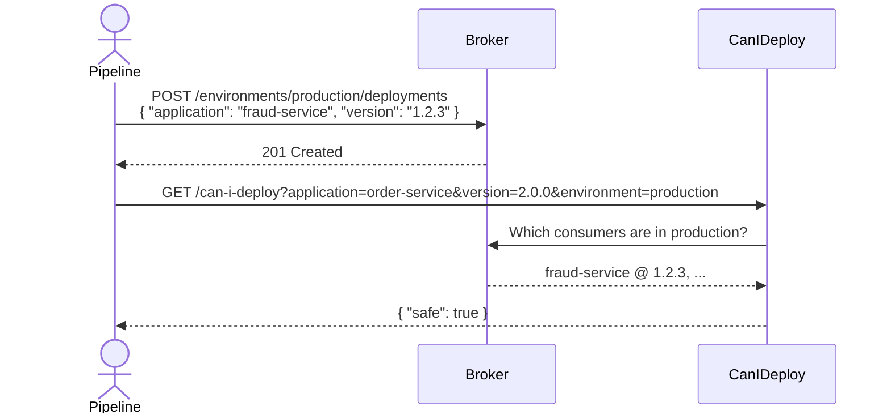

# Environment Tracking

Tell the broker which version of each service is deployed in each environment,
so that [Can I Deploy](can-i-deploy.md) can make accurate, environment-scoped safety decisions.

## What is environment tracking?

Environment tracking is the act of recording, after each deployment, which version of an
application is currently running in a given environment (e.g. `staging`, `production`).

The broker stores at most one version per application per environment. Recording a new
deployment for the same application and environment replaces the previous entry.

Can I Deploy uses this information to answer: _"Are all the consumers currently running
in production compatible with the new version I am about to deploy?"_

## Why it matters

Without environment tracking, Can I Deploy can only ask _"Has any consumer ever verified
against this version?"_ — which includes teams running old consumers that were retired
months ago, and excludes the real question: _which consumers are actually running in the
target environment right now?_

With environment tracking the check becomes precise: only the consumers that are
**currently deployed in the target environment** need to have a successful verification
result. Consumers that have been replaced or removed are automatically excluded.

## How it works

1. Your CI/CD pipeline deploys a service and records the deployment to the broker.
2. The broker updates (or creates) one record per `application + environment`.
3. Can I Deploy queries those records when evaluating whether a new version is safe to deploy.



## API

All endpoints require HTTP Basic credentials. Use the `Authorization: Basic ...` header
or the `--username` / `--password` CLI flags.

### Record a deployment

```
POST /api/v1/environments/{environment}/deployments
```

Body:

```json
{
  "application": "fraud-service",
  "version": "1.2.3"
}
```

Response: `201 Created`

```json
{
  "environment": "production",
  "application": "fraud-service",
  "version": "1.2.3",
  "createdAt": "2024-08-14T10:30:00Z"
}
```

The application must already be registered in the broker (see
[Application Registration](application-registration.md)). If the application is already
recorded in the environment, the version is updated in place.

curl example:

```bash
curl -X POST https://broker.example.com/api/v1/environments/production/deployments \
  -H "Authorization: Basic $(echo -n admin:admin | base64)" \
  -H "Content-Type: application/json" \
  -d '{"application": "fraud-service", "version": "1.2.3"}'
```

### List deployments in an environment

```
GET /api/v1/environments/{environment}/deployments
```

Response: `200 OK`

```json
{
  "content": [
    { "environment": "production", "application": "fraud-service", "version": "1.2.3", "createdAt": "..." },
    { "environment": "production", "application": "order-service",  "version": "2.0.0", "createdAt": "..." }
  ],
  "page": 0,
  "size": 20,
  "totalElements": 2
}
```

Query parameters: `page` (default 0), `size` (default 20), `sort` (default `createdAt,desc`).

curl example:

```bash
curl https://broker.example.com/api/v1/environments/production/deployments \
  -H "Authorization: Basic $(echo -n admin:admin | base64)"
```

### Get the current deployment for one application

```
GET /api/v1/environments/{environment}/deployments/{applicationName}
```

Response: `200 OK`

```json
{
  "environment": "production",
  "application": "fraud-service",
  "version": "1.2.3",
  "createdAt": "2024-08-14T10:30:00Z"
}
```

Returns `404` with error code `DEPLOYMENT_NOT_FOUND` if the application is not recorded
in that environment.

### Remove a deployment

Record that an application is no longer running in an environment:

```
DELETE /api/v1/environments/{environment}/deployments/{applicationName}
```

Response: `204 No Content`

curl example:

```bash
curl -X DELETE \
  https://broker.example.com/api/v1/environments/production/deployments/fraud-service \
  -H "Authorization: Basic $(echo -n admin:admin | base64)"
```

## Plugin and CLI integration

### Maven plugin

Use the `publish-to-environment` goal to record a deployment as part of your build.
Configure it in the same plugin declaration as `publish`:

```xml
<plugin>
    <groupId>sh.stubborn</groupId>
    <artifactId>stubborn-maven-plugin</artifactId>
    <version>${broker.version}</version>
    <configuration>
        <brokerUrl>http://localhost:8642</brokerUrl>
        <username>admin</username>
        <password>admin</password>
        <applicationName>${project.artifactId}</applicationName>
        <applicationVersion>${project.version}</applicationVersion>
        <environment>production</environment>
    </configuration>
    <executions>
        <execution>
            <id>record-deployment</id>
            <goals>
                <goal>publish-to-environment</goal>
            </goals>
        </execution>
    </executions>
</plugin>
```

Run manually:

```bash
mvn stubborn:publish-to-environment \
    -Dbroker.url=https://broker.example.com \
    -Dbroker.username=${BROKER_USER} \
    -Dbroker.password=${BROKER_PASS} \
    -Dbroker.environment=production
```

### npm CLI

```bash
# Record a deployment
stubborn deploy record --app fraud-service --version 1.2.3 --env production

# List what is deployed in an environment
stubborn deploy list --env production

# Get the current version of one application
stubborn deploy get --app fraud-service --env production
```

Global connection options (`--broker-url`, `--username`, `--password`) apply to all
`deploy` subcommands. See [CLI](cli.md) for full global option reference.

## Errors

| HTTP status | Error code | Cause |
| --- | --- | --- |
| 400 | `VALIDATION_ERROR` | Invalid environment name or version format |
| 404 | `APPLICATION_NOT_FOUND` | Application is not registered in the broker |
| 404 | `DEPLOYMENT_NOT_FOUND` | No deployment recorded for this application in the environment |

Environment names must be lowercase alphanumeric and hyphens, 1–64 characters.
Versions must follow semantic versioning.

## Named environments

The broker auto-creates an environment when a deployment is first recorded to it, so no
setup is required before recording your first deployment. To create environments
explicitly, rename them, set a production flag, or control display order, see
[Configurable Environments](configurable-environments.md).

See specification: [docs/specs/004-environment-tracking.md](https://github.com/stubborn-sh/stubborn/blob/main/docs/specs/004-environment-tracking.md)


