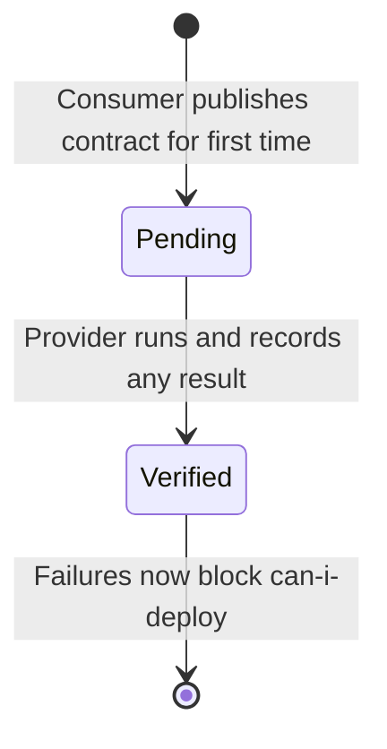

# Pending Contracts

Pending contracts are newly published contracts that have not yet been verified by the
provider. Verification failures against pending contracts do not block Can I Deploy checks,
allowing consumers to publish contracts before providers have implemented them.

See specification: [docs/specs/014-pending-contracts.md](https://github.com/stubborn-sh/stubborn/blob/main/docs/specs/014-pending-contracts.md)

## The Bootstrapping Problem

Consumer-driven contract testing relies on a feedback loop: the consumer publishes a
contract, the provider verifies it, and Can I Deploy gates deployment on that result.
This creates a chicken-and-egg problem when a consumer publishes a contract for the
**first time**:

- No verification exists yet for the new contract.
- Can I Deploy has no passing result to point to.
- Without special handling, it would immediately block every provider deployment.

This makes it impossible to introduce new contracts incrementally. The provider would
need to implement and verify the contract before the consumer is even allowed to express
the expectation.

Pending contracts solve this by treating a contract leniently until the provider has had
the chance to verify it at least once.

## How It Works

A contract is **pending** for a provider branch if no verification — pass or fail — has
ever been recorded for that contract on that branch.

- While pending, Can I Deploy treats the contract as satisfied. Failures do not block
  deployment.
- The first time the provider runs verification and records any result (success or
  failure), the contract transitions to **active** for that branch. From that point on,
  failures block deployment as normal.

Pending status is tracked **per provider branch**. A contract can be pending on a
feature branch but already active on `main`.

### Lifecycle



## Configuration

Pending contract leniency is **opt-in** at query time via the `includePending=true`
parameter on the Can I Deploy endpoint. When this parameter is omitted or set to
`false`, pending contracts are treated identically to active contracts — failures block
deployment.

| `includePending` | Behaviour |
|-----------------|-----------|
| `true` | Pending contract failures are excluded from the `safe` result |
| `false` or omitted | Pending contracts are treated as active (failures block) |

Pending contracts are always included in the response body for visibility, regardless of
the parameter value.

## API

### Check Can I Deploy with Pending Support

```
GET /api/v1/can-i-deploy?application={name}&version={v}&branch={b}&includePending=true
```

**Example — provider with two pending contracts:**

```bash
curl -s "https://broker.example.com/api/v1/can-i-deploy\
?application=order-service\
&version=1.0.0\
&branch=main\
&includePending=true" | jq .
```

**Response:**

```json
{
    "safe": true,
    "summary": "All active contracts verified. 2 pending contracts ignored.",
    "verifiedContracts": [],
    "pendingContracts": [
        {
            "consumerName": "new-frontend",
            "consumerVersion": "1.0.0",
            "contractName": "shouldReturnUserProfile",
            "status": "PENDING",
            "reason": "Never verified successfully on branch main"
        }
    ],
    "failedContracts": []
}
```

The `pendingContracts` array lists every contract that was excluded from the safety
evaluation. The `summary` field states how many were ignored so the result is
transparent to the caller.

## Business Rules

1. A contract is pending for a branch if **no verification** (success or failure) has
   ever been recorded for that contract on that branch.
2. Pending status is scoped to the combination of consumer name, contract name, and
   provider branch.
3. Once any verification is recorded on a branch, the contract is **permanently active**
   for that branch — there is no way to reset it to pending.
4. A contract can be pending on one branch and active on another simultaneously.
5. With `includePending=false` (the default), pending contracts behave like active
   contracts and failures block deployment.

## Scenarios

### New Contract Does Not Block Provider

A consumer publishes `shouldReturnUserProfile` for the first time. The provider has not
yet run verification. Calling Can I Deploy with `includePending=true` returns `safe: true`
and lists the contract in `pendingContracts`.

### Failure While Pending Still Does Not Block

The provider runs verification and it fails. Because no successful verification has
ever been recorded, the contract remains pending. Can I Deploy continues to return
`safe: true` with `includePending=true`.

### Contract Graduates to Active

The provider fixes the implementation and verification passes. The contract is now
permanently active on that branch. Any subsequent failure will cause Can I Deploy to
return `safe: false`, regardless of the `includePending` parameter.

### Per-Branch Isolation

The contract is active on `main` (previously verified) but pending on `feature/v2`
(never verified). Can I Deploy checks against `feature/v2` with `includePending=true`
treat it as pending; checks against `main` treat it as active.
